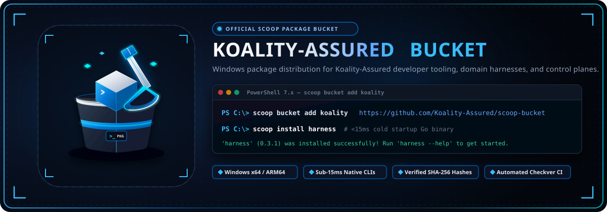
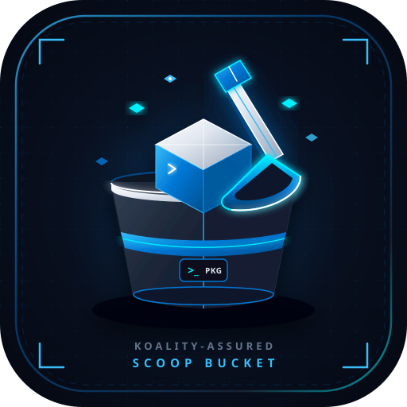

<div align="center">



<br/><br/>



# Koality-Assured Scoop Bucket

**Official Windows package distribution repository for Koality-Assured developer tooling, domain harnesses, and autonomous agent control planes.**

[](https://scoop.sh)
[](LICENSE)
[](bucket/)
[]()
[](https://github.com/Koality-Assured/harness-cli)

<br/>

</div>

---

## Overview

The **Koality-Assured Scoop Bucket** (`koality`) provides automated, first-class Windows package management for developer CLI tools, AI agent orchestration harnesses, and domain control planes built by [Koality-Assured](https://github.com/Koality-Assured).

[Scoop](https://scoop.sh) is a command-line installer for Windows that eliminates UAC popups, avoids polluting system environment variables, installs dependencies into self-contained user directory sandboxes (`~/scoop/apps/`), and creates clean executable shims (`~/scoop/shims/`) directly accessible from PowerShell, Windows Terminal, and Command Prompt.

### Key Highlights
- **Zero Administrative Privilege Required**: Installs entirely in user-space without elevation prompts.
- **Cross-Architecture Support**: Native 64-bit (`x64`/`amd64`) and Windows on ARM (`arm64`) binary distributions.
- **Sub-15ms Cold Boot**: Distributes compiled native Go control planes (`harness`) engineered for instantaneous execution.
- **Cryptographic Integrity**: Every release is locked with verified SHA-256 hashes against immutable GitHub Release assets.
- **Automated Upstream Synchronization**: Manifests leverage Scoop's `checkver` and `autoupdate` specifications to track new releases immediately upon publication.

---

## Quickstart & Installation

### Prerequisites

Ensure you have [Scoop](https://scoop.sh) installed in PowerShell:

```powershell
# Set execution policy and install Scoop (if not already installed)
Set-ExecutionPolicy -ExecutionPolicy RemoteSigned -Scope CurrentUser
irm get.scoop.sh | iex
```

Verify `git` is installed (required by Scoop to manage bucket repositories):

```powershell
scoop install git
```

---

### Step 1: Add the Bucket

Register the official Koality-Assured bucket in Scoop:

```powershell
scoop bucket add koality https://github.com/Koality-Assured/scoop-bucket
```

To verify that the bucket was successfully registered:

```powershell
scoop bucket list
```

---

### Step 2: Install Packages

Install the Unified Harness CLI Control Plane:

```powershell
scoop install harness
```

*Tip: If you have multiple buckets configured with overlapping names, you can explicitly qualify the package with the bucket name:*

```powershell
scoop install koality/harness
```

---

### Step 3: Upgrade Packages

Update bucket definitions and upgrade `harness`:

```powershell
# Update bucket manifests
scoop update koality

# Upgrade harness to the latest release
scoop update harness

# Or upgrade all installed Scoop packages
scoop update *
```

---

### Step 4: Verify Installation

Confirm that the binary is available on your `PATH`:

```powershell
harness --version
harness status
```

---

## Available Manifests

The following applications are currently distributed through this bucket:

| Manifest | Application | Version | Architectures | Description | Upstream Repository |
| :--- | :--- | :--- | :--- | :--- | :--- |
| [`bucket/harness.json`](bucket/harness.json) | `harness` | `0.3.1` | `x64`, `ARM64` | Unified compiled Go control plane for domain harnesses, worktree concurrency, Bubble Tea TUI, and ACP v1 | [Koality-Assured/harness-cli](https://github.com/Koality-Assured/harness-cli) |

---

## Package Lifecycle Architecture

The following diagram illustrates how Scoop interacts with this repository and upstream GitHub Releases:

```mermaid
flowchart TD
    subgraph Client["Developer Workstation (Windows)"]
        Terminal["PowerShell / Windows Terminal"]
        ScoopCLI["Scoop Package Manager"]
        Shims["Executable Shims<br/>(~&#47;scoop&#47;shims&#47;harness.exe)"]
        AppDirectory["Isolated App Sandbox<br/>(~&#47;scoop&#47;apps&#47;harness&#47;current&#47;)"]
    end

    subgraph BucketRepo["Koality-Assured Scoop Bucket"]
        BucketMeta["Git Repository<br/>Koality-Assured&#47;scoop-bucket"]
        ManifestFile["Manifest: bucket&#47;harness.json<br/>(v0.3.1, SHA-256, URL patterns)"]
    end

    subgraph UpstreamRelease["Upstream Distribution (GitHub Releases)"]
        ReleaseAssetAMD64["harness_0.3.1_windows_amd64.zip"]
        ReleaseAssetARM64["harness_0.3.1_windows_arm64.zip"]
    end

    Terminal -->|scoop bucket add koality| ScoopCLI
    ScoopCLI -->|Clone / Fetch| BucketRepo
    BucketRepo --> ManifestFile

    Terminal -->|scoop install harness| ScoopCLI
    ScoopCLI -->|Read Manifest &amp; Verify Hash| ManifestFile
    ManifestFile -->|Download Release Archive| UpstreamRelease

    UpstreamRelease -->|Unpack Binary| AppDirectory
    AppDirectory -->|Generate Shim| Shims
    Shims -.->|Instant Execution (&lt;15ms)| Terminal
```

---

## Manifest Specifications & Autoupdate

All manifests in `bucket/` strictly adhere to the [Scoop App Manifest Specification](https://github.com/ScoopInstaller/Scoop/wiki/App-Manifests).

### Automated Version Detection (`checkver`)

Manifests declare upstream release tracking:

```json
{
  "checkver": "github",
  "autoupdate": {
    "architecture": {
      "64bit": {
        "url": "https://github.com/Koality-Assured/harness-cli/releases/download/v$version/harness_$version_windows_amd64.zip"
      },
      "arm64": {
        "url": "https://github.com/Koality-Assured/harness-cli/releases/download/v$version/harness_$version_windows_arm64.zip"
      }
    }
  }
}
```

When a new version tag is published to [Koality-Assured/harness-cli](https://github.com/Koality-Assured/harness-cli), automated CI workflows execute `checkver -u` to update the version and recalculate the SHA-256 hashes across both `64bit` and `arm64` targets.

---

## Contributing New Manifests

We welcome community contributions and new tooling manifests for Koality-Assured ecosystem utilities.

### Manifest Guidelines

1. **Naming**: The manifest file must be named `<app>.json` and placed under the `bucket/` directory.
2. **Architecture**: Whenever possible, provide both `64bit` and `arm64` archive URLs and SHA-256 hashes.
3. **Reproducibility**: Use HTTPS URLs pointing to release artifacts, not raw branch heads.
4. **License**: Specify the valid SPDX license identifier (e.g., `MIT`, `Apache-2.0`).
5. **No Elevate**: Manifests must not require administrative escalation unless strictly necessary.

### Local Validation Steps

Before submitting a Pull Request, validate your manifest locally:

```powershell
# 1. Validate JSON syntax and structure
python -c "import json; json.load(open('bucket/harness.json', encoding='utf-8'))"
# Alternatively in PowerShell:
Get-Content bucket\harness.json -Raw | Test-Json

# 2. Test local installation using Scoop
scoop install .\bucket\harness.json

# 3. Test uninstallation
scoop uninstall harness
```

### Submitting a Pull Request

Follow [Conventional Commits](https://conventionalcommits.org) for commit messages and PR titles:

```bash
git checkout -b feat/manifest-new-tool
# Edit or add bucket/tool.json
git commit -m "feat(manifest): add new-tool v1.0.0"
git push -u origin feat/manifest-new-tool
gh pr create --title "feat(manifest): add new-tool v1.0.0" --body "..."
```

---

## Troubleshooting & FAQ

### Bucket Already Installed
If you encounter an error stating that the bucket already exists:

```powershell
scoop bucket rm koality
scoop bucket add koality https://github.com/Koality-Assured/scoop-bucket
```

### Hash Check Mismatch
If an upstream release asset was re-published and the cached hash fails:

```powershell
scoop cache rm harness
scoop update koality
scoop install harness
```

### Clean Removal
To completely remove packages and the bucket from your system:

```powershell
scoop uninstall harness
scoop bucket rm koality
```

---

## License

This repository is distributed under the terms of the [MIT License](LICENSE).

Individual applications distributed via manifests maintain their respective open-source licenses as declared in their individual JSON definitions.
